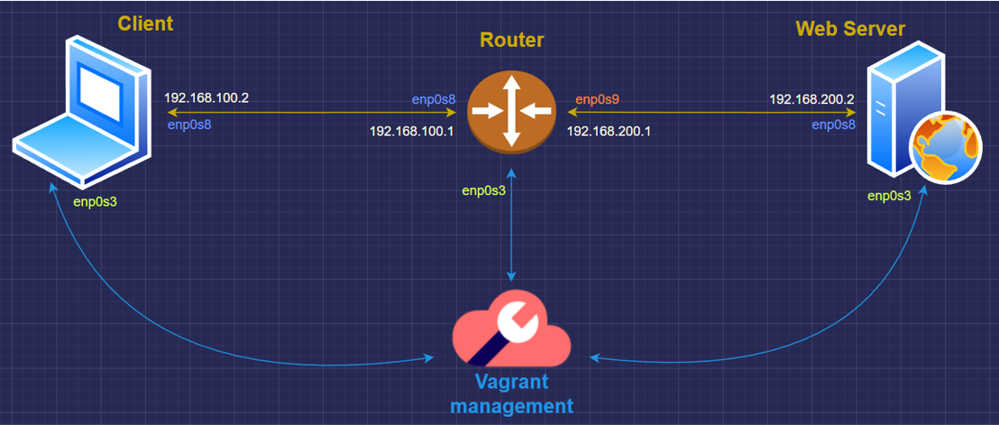
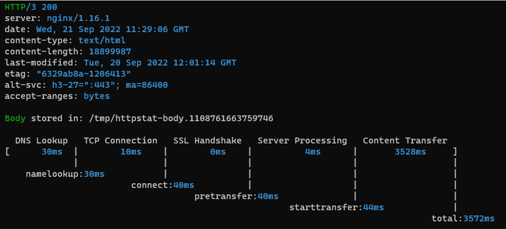

# HTTP3/QUIC on a NGINX Web Server

OBJECTIVES
- 
- To Deploy a Web Server and a Client using Virtual Machines.
  - Both must be compatible with the HTTP3 protocol.
- To Measure the throughput of the established connection.

Softwares and other tools used
- 
- **Vagrant** (for the deployment of the VMs)
- **Virtualbox** (in conjunction with Vagrant)
- **Docker** (to create and run the Web Server image)
- **VcXsrv + Putty** (to visualize the website through SSH on Windows)
- **Duckdns** (to register a DNS)
- **Certbot** (to obtain TSL/SSL certificates)
- **ymuski/curl-http3** (Docker image used to test the connection)

Topology of the network
- 
- To make the topology scalable a router has also been created.


1- Requesting TSL/SSL certificates
- 
- In order to work, HTTP3 needs a real Domain Name (DNS) and TSL/SSL certificates.
- A DNS is registered under the name http3testing.duckdns.org
- The request is then sent:
 `certbot -d http3testing.duckdns.org --manual --preferred-challenges dns certonly`
 - The response is a request to edit the TXT records of the DNS. This is done with this line:
 `https://www.duckdns.org/update?domains={YOURVALUE}&token={YOURVALUE}&txt={YOURVALUE}[&verbose=true][&clear=true]`
- 2 files (privkey.pem and fullchain.pem) can now be found in the Certbot system folder and must be placed in the **/certs** folder, so to get accessible from the Virtual Machines.

2 - Creating the Docker Image of the Web Server
- 
- To create the Dockerfile, the image ymuski/nginx-quic has been used as reference, aswell as the official guide by CloudFlare at https://github.com/cloudflare/quiche/tree/master/nginx
- The image is then pushed at chocolat1/http3server in the Docker Hub
- The configuration file is also created and put in the /docker folder. The content:

```
events {
    worker_connections 1024;
}

http {

    server {
        # https://github.com/cloudflare/quiche/tree/master/extras/nginx
        # Enable QUIC and HTTP/3.
        listen 443 quic reuseport;

        # Enable HTTP/2 (optional).
        listen 443 ssl http2;

        server_name http3testing.duckdns.org www.http3testing.duckdns.org;

        ssl_certificate certs/fullchain.pem;
        ssl_certificate_key certs/privkey.pem;

        # Enable all TLS versions (TLSv1.3 is required for QUIC).
        ssl_protocols TLSv1.3;
        ssl_early_data on;


        # Request buffering in not currently supported for HTTP/3.
        proxy_request_buffering off;

        # Add Alt-Svc header to negotiate HTTP/3.
        add_header alt-svc 'h3-27=":443"; ma=86400';

        location / {
            root html;
            index index.html index.htm;
        }
    }
}

```
As written above, the index.html file will be located in the docker/html/ folder.

3 - Vagrantfile configuration
- 

-  The graphical output must be enabled
```
 config.ssh.forward_agent = true
 config.ssh.forward_x11 = true
```
 - The memory is increased to 2 GB in both the client and the server
 ```
 vb.memory = 2048
```

4 - In the client.sh
- 
- The port are associated with IPs and routes are created.
- **Docker** is installed, aswell as **Google Chrome**, **Xorg** for the graphical output and **curl-http3** for the testing.
 ```
export DEBIAN_FRONTEND=noninteractive

sudo ip addr add 192.168.100.2/30 dev enp0s8
sudo ip link set dev enp0s8 up
sudo ip route add 192.168.200.0/30 via 192.168.100.1

# Docker
sudo apt-get update
sudo apt-get -y install docker.io
sudo systemctl start docker
sudo systemctl enable docker

# XORG
sudo apt-get update
sudo apt-get -y install xorg

# Google Chrome
wget -q -O - https://dl-ssl.google.com/linux/linux_signing_key.pub | sudo apt-key add -
sudo sh -c 'echo "deb https://dl.google.com/linux/chrome/deb/ stable main" >> /etc/apt/sources.list.d/google.list'
sudo apt-get update
sudo apt-get -y install google-chrome-stable

# CURL-HTTP3
sudo docker pull ymuski/curl-http3
```

5 - In the webserver.sh
- 
- The port are associated with IPs and routes are created also in this case.
- **Docker** is installed, aswell as **Google Chrome**
- Then the webserver is started, with the configuration and the certificates created previously.
```
export DEBIAN_FRONTEND=noninteractive
sudo ip addr add 192.168.200.2/30 dev enp0s8
sudo ip link set dev enp0s8 up
sudo ip route add 192.168.100.0/30 via 192.168.200.1

# Docker
sudo apt-get update
sudo apt-get -y install docker.io
sudo systemctl start docker
sudo systemctl enable docker

# Google Chrome
wget -q -O - https://dl-ssl.google.com/linux/linux_signing_key.pub | sudo apt-key add -
sudo sh -c 'echo "deb https://dl.google.com/linux/chrome/deb/ stable main" >> /etc/apt/sources.list.d/google.list'
sudo apt-get update
sudo apt-get -y install google-chrome-stable

# Running the server
sudo docker run --name h3web -d -p 80:80 -p 443:443/tcp -p 443:443/udp -v /vagrant/docker/http3.web.conf:/etc/nginx/nginx.conf -v /vagrant/certs/:/etc/nginx/certs/ -v /vagrant/docker/html/:/etc/nginx/html/ chocolat1/http3server:first
```
    
6 - In the router.sh
- 
- The only tuning is regarding the ports and the routes
```
export DEBIAN_FRONTEND=noninteractive
sudo ip addr add 192.168.100.1/30 dev enp0s8
sudo ip link set dev enp0s8 up
sudo ip addr add 192.168.200.1/30 dev enp0s9
sudo ip link set dev enp0s9 up
sysctl -w net.ipv4.ip_forward=1
```

7 - Starting the created environment with Vagrant
-
- In the terminal, in the main directory (cd .../dncs-http3)
`vagrant up`
- The VMs are created. Each machine is accessible through ssh using:
 `vagrant ssh [v-machine]`
- With the next line is possible to curl (from the client) using HTTP3.
`sudo docker run -it --rm ymuski/curl-http3 ./httpstat.sh https://http3testing.duckdns.org:443  --http3`

8 - Connecting with the X-Server
- 
- In windows, VcXsrv is started.
- Using **Puttygen** we can locate and load the file "privkey", located in **.vagrant\machines\client\virtualbox**
- Then the new private key must be saved somewhere (as .ppk).
- Using now **Putty** we load the created key and set the IP and ports of the client.
    - To know those information, we can use  `vagrant ssh-config`  in the terminal.
- Once the server is started, we can open google chrome, with HTTP3 compatibility:
`google-chrome --enable-quic --quic-version=h3-29`
- Now we just need to go to https://http3testing.duckdns.org and the site should be up.

9- Testing the Protocol
- 
- Now that everything is set up, with the previously mentioned command we can curl using http3
`sudo docker run -it --rm ymuski/curl-http3 ./httpstat.sh https://http3testing.duckdns.org:443  --http3`
- The output will be the timings of different steps during the connection and the downloading of the index.html file from the webserver. 

- Using these numbers we can obtain an approssimation of the throughput.
- With an average of 4500ms using a 18MB file, we can say that the throughput is approximately 4MB/s (32mbps) in this experiment.


References and guides
-

- https://blog.cloudflare.com/experiment-with-http-3-using-nginx-and-quiche/
- https://github.com/cloudflare/quiche
- https://github.com/albertocasagrande99/dncs-lab2
- https://jcook0017.medium.com/how-to-enable-x11-forwarding-in-windows-10-on-a-vagrant-virtual-box-running-ubuntu-d5a7b34363f#:~:text=Finally%20go%20to%20Connection%2D%3ESSH,say%20yes%20to%20the%20prompt.
- https://hub.docker.com/r/ymuski/curl-http3
- https://hub.docker.com/r/ymuski/nginx-quic
- https://certbot.eff.org/instructions?ws=nginx&os=ubuntubionic
- https://community.letsencrypt.org/
